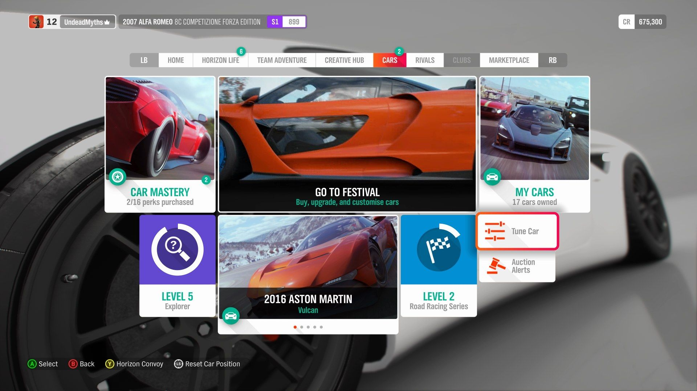

# About game menus

I see myself as a menu geek (wonder if that's a real term), that is whenever I start a new game, I always go into the setting menus to see what's there, how I can tweak it, and how the menus are actually designed. 

If you have played games, any game, you probably know where to click to start a new game, or continue from the last time you turned it off. Most often, you'd find a list menu, where every options are listed as a vertical or horizontal list. 

*Thumper's simple menu*.

Don't get me wrong, these would definitely get the job done. But the more time the player spent on the menu, the less time they spend on playing the actual game and enjoy it. The worst offender, in my opinion, are tabbed menus where you have multiple vertical columns but you can only see one at a time, and have to scroll pass multiple columns if what you're looking for is not the first one or two.

*Burnout Paradise's menu, with left and right pages accessible by pressing F1 and F2*.

I used to play Burnout Paradise on my Surface Go a lot. The Surface Go is, indeed, very underpowered, so I had to go digging in the game's menu to tweak graphics setting. Each and every time was a chore.

But that is necessary if the game wants to offer players more option to tweak the game or access its feature. Some games circumvent the tedium of tabbed menus by doing a matrix menu. A good example of this is Forza Horizon series. 

*I can spend hours digging through these options. At least they look nice.*

I should have said 'better' instead of 'good'. Horizon's menu is honestly a matrix of its own, now that there are not only tabs, but nested matrices. It took me a full minute just to find the 'Auction' menu. Not only it breaks immersion, it literally wasted my time.

Some games circumvent this problem by introducing an in-game menu that doesn't pause the game to become accessible. Such example is the Easy Drive in Criterion's racing games like Burnout Paradise (*sigh*), Need for Speed 2010 and 2012. But this kind of menu is, in my opinion, a band-aid for an amputee. It doesn't solve the root problem of poorly designed game menu, it just makes it more bearable.

This aspect of video games often go unnoticed. It is an essential part of a game no doubt, but it's often taken for granted by the player and/or skimped by the developer. The best way to do a game's menu justice, for the sake of players' immersion, is to go all out on the menu, or have as little menu as possible.

One way to have as little menu as possible is to require as few clicks as possible from the player to get into the game. Indie games do this pretty well as they usually don't have too many moving parts that require an option menu to tweak.

*One button and Bam, you're in the game.*

The other way is to go all-out, have the menu be integrated into the game's world, have the player roam around in it, explore it, make the menu as lively as possible. Such is the case of Colin McRae Dirt 2.

*The idea of having you travel around in a trailer is incredible.*

Instead of having you look at a list, the menu is represented by real objects in the player avatar's surroundings: races as items on a map or posters, cars as cards on the table (and the car's right there!). The idea of having you travelling around in a trailer is frankly genius. Of course, some settings are tucked into a list menu, but it's a list on a table! And most of there settings only require you to access once and forget about.

That's my two cents about game menu design. I hope you enjoyed reading it.